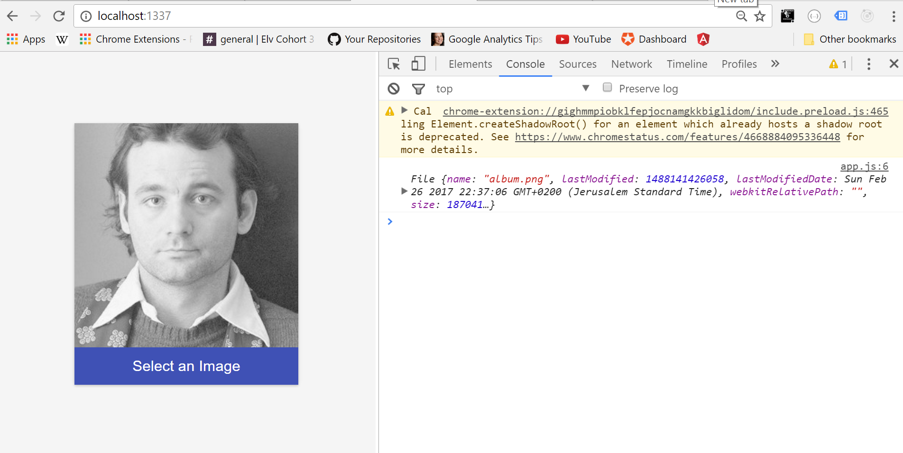

# Image Upload Client-Side with Cloudinary

1. `git clone` this repo
2. `npm install`
3. `npm start`
4. You're ready to upload dank memes.

Check out the video tutorial at: <a href="https://www.youtube.com/watch?v=6uHfIv4981U" target="_blank">Image Upload in 15 Minutes with Cloudinary and Javascript - Tutorial</a>
